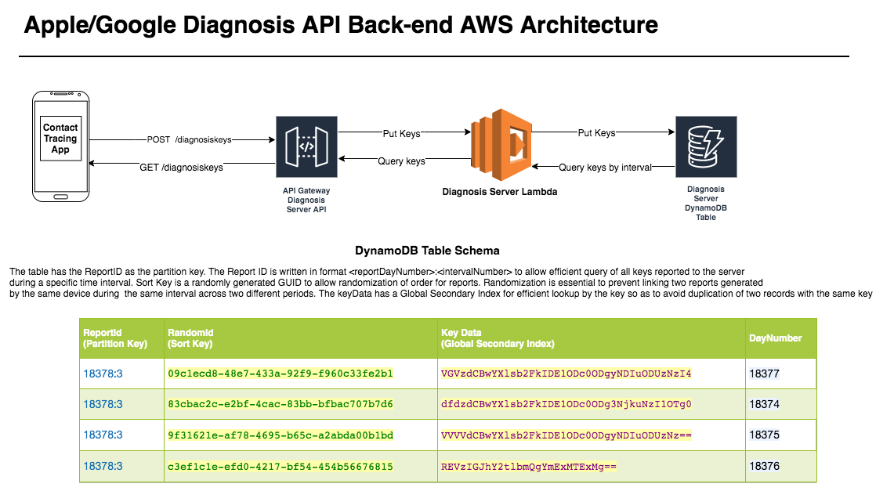

## Apple/Google Diagnosis Server for Digital Contact Tracing

This is an implementation of the back-end diagnosis server for digital contact tracing
built designed to deploy to AWS Serverless infrastructure. The server provides two API endpoints, POST for putting 
a batch of diagnosis keys and GET for retrieval of diagnosis keys reported during a fixed time interval. Retrieval
during a fixed time interval allows us to optimize cost and latency by adding the ability to cache all keys
for the past intervals in CDN and also used as a pagination strategy. More details on the Apple/Google contact tracing
protocol can be found [here](https://www.apple.com/covid19/contacttracing). In the current version, key signature
verification is not implemented because the specs for that haven't been released yet.

### Design

The Server Open API definition can be found in this repository under [api_definition](api_definition/ag_diag_server_1.0.0.yml) 
folder.

* **Compute**: AWS Lambda
* **Data Store**: DynamoDB
* **Routing and Load Balancing**: API Gateway
* **Permissions Management**: IAM




### Server Deployment

Infrastructure setup automation is done using [terraform](https://www.terraform.io/). With the below steps, 
you'll be able to stand-up the server infrastructure in your AWS account with a single `terraform apply` command.

1. Ensure you have the AWS CLI configured, working, and pointing to the default AWS
   account you wish to deploy to using `aws configure`
2. [Install Terraform](https://www.terraform.io/downloads.html) 0.12 or newer
   (Recommendation is to install via Choco for Windows/Homebrew for macOS/package managers for
   *nix)
4. `cd` to the `terraform` folder in this repo
6. Run `terraform init`
7. Run `terraform plan` to see what changes will be applied to
   your AWS account
8. Run `terraform apply -auto-approve` to make the changes and deploy the
   server.
9. When the Terraform scripts are updated or you wish to redeploy, repeat steps
   7 and 8.
10. The API Server endpoint should be visible on the command prompt

```sh
Outputs:

gateway_base_url = https://5zkk34sdej.execute-api.us-west-2.amazonaws.com/v1/diagnosiskeys
```


### Testing

#### POST
```json
curl -X POST https://5zkk34sdej.execute-api.us-west-2.amazonaws.com/v1/diagnosiskeys -d "[{\"keyData\":\"c2JlcnRvZGxma2hqdDQ1Ngo=\",\"dayNumber\":\"18374\"},{\"keyData\":\"c2I3NjU0ZGxma2hqdDQ1Ngo=\",\"dayNumber\":\"18375\"},{\"keyData\":\"MTEyMjU0ZGxma2hqdDQ1Ngo=\",\"dayNumber\":\"18376\"},{\"keyData\":\"MTEyMmlvcHVma2hqdDQ1Ngo=\",\"dayNumber\":\"18377\"}]"
```
#### GET
```json

curl -X GET "https://5zkk34sdej.execute-api.us-west-2.amazonaws.com/v1/diagnosiskeys

curl -X GET "https://5zkk34sdej.execute-api.us-west-2.amazonaws.com/v1/diagnosiskeys?reportDayNumber=18378

curl -X GET "https://5zkk34sdej.execute-api.us-west-2.amazonaws.com/v1/diagnosiskeys?reportDayNumber=18378&intervalNumber=3&intervalLength=21600"


Output:


[{"dayNumber":18375,"keyData":"c2I3NjU0ZGxma2hqdDQ1Ngo="},{"dayNumber":18376,"keyData":"MTEyMjU0ZGxma2hqdDQ1Ngo="},{"dayNumber":18374,"keyData":"c2JlcnRvZGxma2hqdDQ1Ngo="},{"dayNumber":18377,"keyData":"MTEyMmlvcHVma2hqdDQ1Ngo="}]
```

### TO DO

1. Implement signature verification.
1. Add unit tests using DynamoDBLocal library
2. Implement CDN caching using Cloudfront and update the terraform stack with the infrastructure parameters
3. Implement reCaptcha or privacy-pass for verification that the client is a human